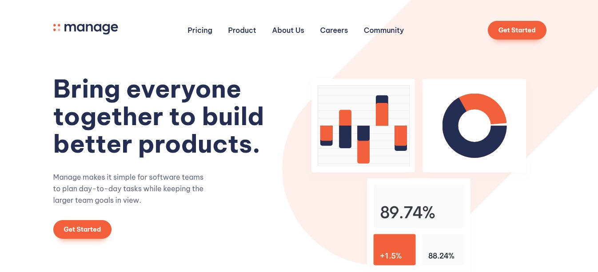
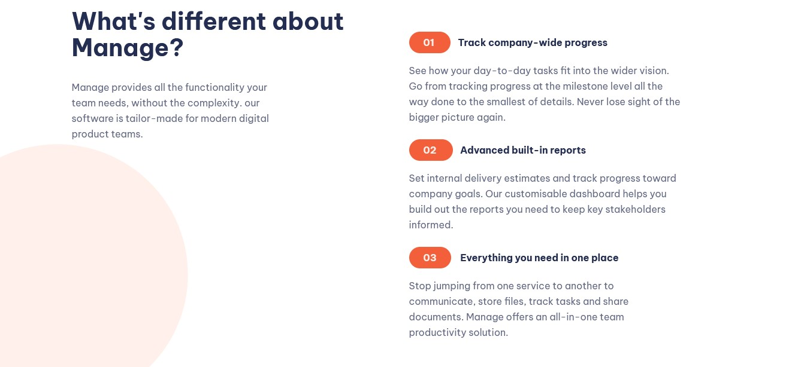
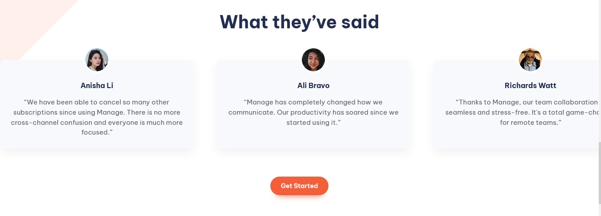
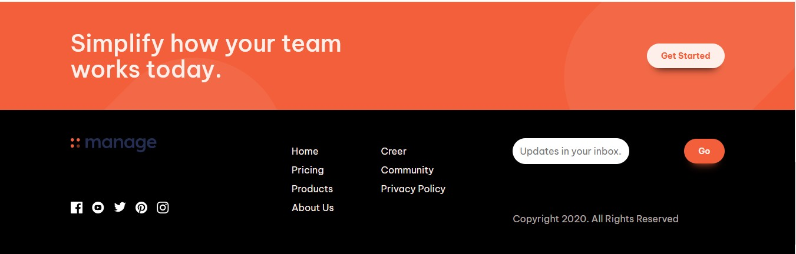

# Frontend Mentor - Manage Landing Page Solution

This is my solution to the [Manage landing page challenge](https://www.frontendmentor.io/challenges/manage-landing-page-SLXqC6P5) on Frontend Mentor. It helped me improve responsive layouts, form validation, and implementing a testimonial slider using Swiper.js.

## 📑 Table of Contents

- [Overview](#overview)
  - [The Challenge](#the-challenge)
  - [Screenshot](#screenshot)
  - [Links](#links)
- [My Process](#my-process)
  - [Built With](#built-with)
  - [What I Learned](#what-i-learned)
  - [Continued Development](#continued-development)
  - [Useful Resources](#useful-resources)
- [Author](#author)

---

## 🧐 Overview

### ✅ The Challenge

Users should be able to:

- View the optimal layout for the site depending on their device's screen size.
- See hover states for all interactive elements.
- View and navigate through testimonials using a responsive Swiper slider.
- Receive real-time validation feedback when submitting the email form if:
  - The input is empty.
  - The email format is incorrect.

---

### 🖼️ Screenshot

---
### 🔗 Links

- Solution URL: [GitHub Repository](https://github.com/C-W-Praduman/Manage-landing-page/)
- Live Site URL: [Live Demo](https://manage-landing-page-rho-seven.vercel.app/)

---

## 🛠️ My Process

### 🔧 Built With

- Semantic **HTML5** markup
- **CSS3** (Flexbox + CSS Variables)
- **JavaScript** (Vanilla)
- **Swiper.js** for the testimonial slider
- **Mobile-first** workflow

---

### 📚 What I Learned

This project helped me:
- Build responsive layouts using mobile-first design.
- Work with slider libraries like Swiper.js for responsive carousels.
- Validate email input using JavaScript and provide real-time feedback.
- Polish UI/UX details like spacing, alignment, and hover effects.

---
### 🔁 Continued Development

In future updates, I plan to:

-Add a dark/light mode toggle.
-Animate the page with scroll-based effects using AOS or GSAP.
-Possibly integrate React or Vue for reusable component structure.

---

### 🌍 Useful Resources

-Swiper.js Docs – Easy-to-integrate slider library used in the testimonials section.

-CSS Tricks – For layout ideas and validation patterns.

-MDN Web Docs – Always helpful for core web concepts.

---

### 👨‍💻 Author

-Github-Profile – [@yourusername](https://github.com/C-W-Praduman)
---
